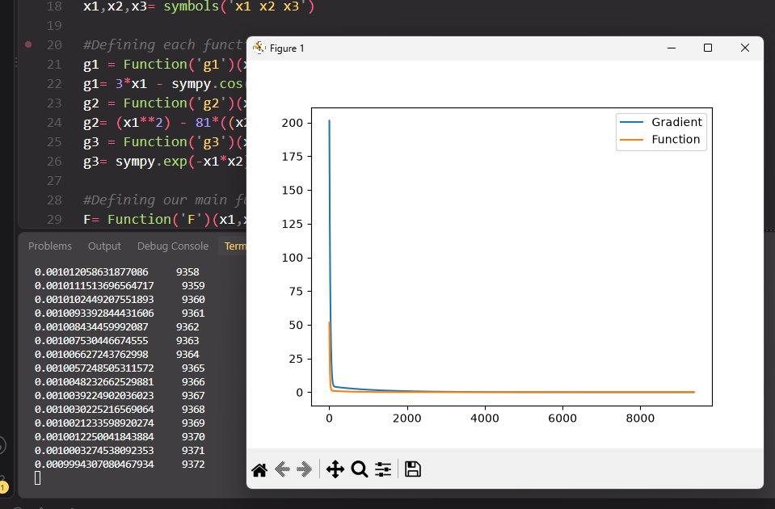
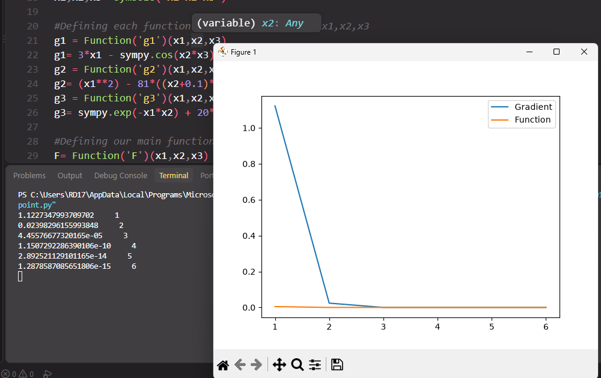
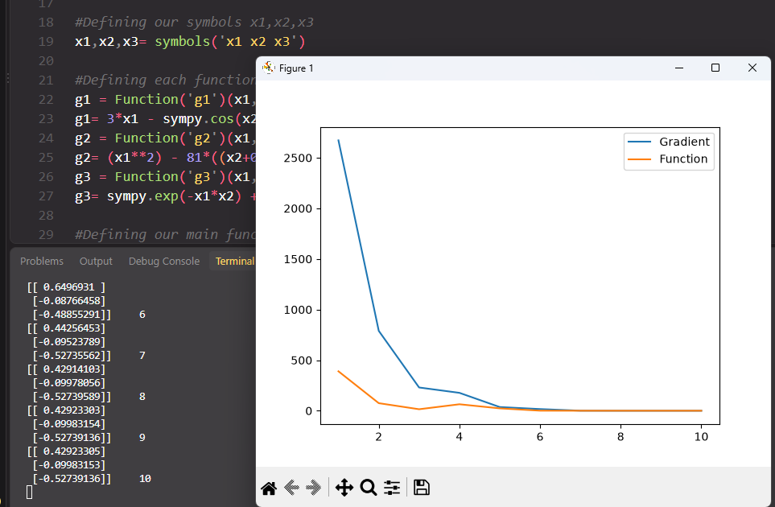

# Numerical Optimization: Gradient Descent & Newton-Raphson

This project implements and compares two numerical optimization methods — **Gradient Descent** and **Newton-Raphson** — for solving a nonlinear system of three equations.

The project formulates the system as a nonlinear least-squares optimization problem and uses **SymPy** for symbolic differentiation and **NumPy** for numerical computation.

## Problem Formulation

The project considers the following nonlinear functions:

$$
g_1(x_1,x_2,x_3)
= 3x_1-\cos(x_2x_3)-0.5
$$

$$
g_2(x_1,x_2,x_3)
= x_1^2-81(x_2+0.1)^2+\sin(x_3)+1.06
$$

$$
g_3(x_1,x_2,x_3)
= e^{-x_1x_2}+20x_3+\frac{10\pi-3}{3}
$$

These equations are converted into the following objective function:

$$
F(x_1,x_2,x_3) = \frac{1}{2}g_1^2 + \frac{1}{2}g_2^2 + \frac{1}{2}g_3^2
$$

Minimizing \(F\) drives the values of \(g_1\), \(g_2\), and \(g_3\) toward zero, providing a numerical solution to the nonlinear system.

---

## Methods

### 1. Gradient Descent

The Gradient Descent implementation updates the solution using:

$$
x_{k+1}=x_k-\alpha\nabla F(x_k)
$$

where:

* \(\alpha = 0.0001\) is the learning rate.
* \(\nabla F\) is the gradient of the objective function.
* The initial point is:

$$
x_0=[0,0,0]^T
$$

The algorithm terminates when the gradient magnitude becomes smaller than the specified tolerance.

### 2. Newton-Raphson

The Newton-Raphson implementation uses both the gradient and Hessian matrix:

**xₖ₊₁ = xₖ − α∇F(xₖ)**

where:

* \(\nabla F(x_k)\) is the gradient.
* \(H(x_k)\) is the Hessian matrix of \(F\).
* The Hessian is recalculated at every iteration.

Two initial conditions are used to demonstrate the behavior of the method from different starting points:

```text
[0, 0, 0]
```

and

```text
[0.77, 0.79, 0.79]
```

---

## Features

* Symbolic formulation of nonlinear equations using **SymPy**
* Automatic calculation of the gradient
* Automatic calculation of the Hessian matrix
* Numerical evaluation using `lambdify`
* Gradient Descent implementation
* Newton-Raphson implementation
* Configurable convergence tolerance
* Iteration tracking
* Gradient magnitude tracking
* Objective-function tracking
* Convergence plots using Matplotlib

## Technologies

* **Python**
* **NumPy** — numerical computation and matrix operations
* **SymPy** — symbolic mathematics, differentiation, and Hessian calculation
* **Matplotlib** — convergence visualization

## Project Structure

```text
.
├── ci_project_gradient_(a,b,c).py
├── ci_project_the_Newton-Raphson's_method.py
└── README.md
```

> The original implementations were developed in Google Colab and later exported to Python scripts.

## Installation

Clone the repository:

```bash
git clone <repository-url>
cd <repository-name>
```

Install the required dependencies:

```bash
pip install numpy sympy matplotlib
```

## Running the Project

Run the Gradient Descent implementation:

```bash
python "ci_project_gradient_(a,b,c).py"
```

Run the Newton-Raphson implementation:

```bash
python "ci_project_the_Newton-Raphson's_method.py"
```

Each implementation prints iteration information and generates a convergence plot showing the behavior of the gradient magnitude and objective function.

## Gradient Descent vs. Newton-Raphson

Both methods optimize the same objective function, but they use different information to determine the next iteration.

| Method           | Information Used   | Main Update                         | Main Parameter |
| ---------------- | ------------------ | ----------------------------------- | -------------- |
| Gradient Descent | Gradient           | \(x_{k+1}=x_k-\alpha\nabla F(x_k)\) | Learning rate  |
| Newton-Raphson   | Gradient + Hessian | \(x_{k+1}=x_k-H^{-1}\nabla F\)      | Hessian        |

Gradient Descent generally uses simpler calculations per iteration but may require many iterations depending on the learning rate and shape of the objective function.

Newton-Raphson incorporates second-order information through the Hessian, allowing it to make more informed updates but requiring additional computation at each iteration.

## Convergence Visualization

Both implementations track:

* **Gradient magnitude** — used as the convergence criterion.
* **Objective function value** — used to observe how the optimization progresses.

The resulting plots provide a visual representation of the convergence behavior over successive iterations.

## Notes

The Newton-Raphson implementation uses matrix inversion to calculate \(H^{-1}\). In larger numerical optimization problems, solving the linear system directly is generally preferable to explicitly computing a matrix inverse.

The project is intended as an educational implementation of numerical optimization techniques and demonstrates the practical use of symbolic differentiation combined with numerical algorithms.

## Screenshots

### Gradient Descent



### Newton-Raphson — Initial Point (0, 0, 0)



### Newton-Raphson — Initial Point (0.77, 0.79, 0.79)



## Authors

* Youssef Malak
* Bavly Ehab
* Bassam Sobhy
