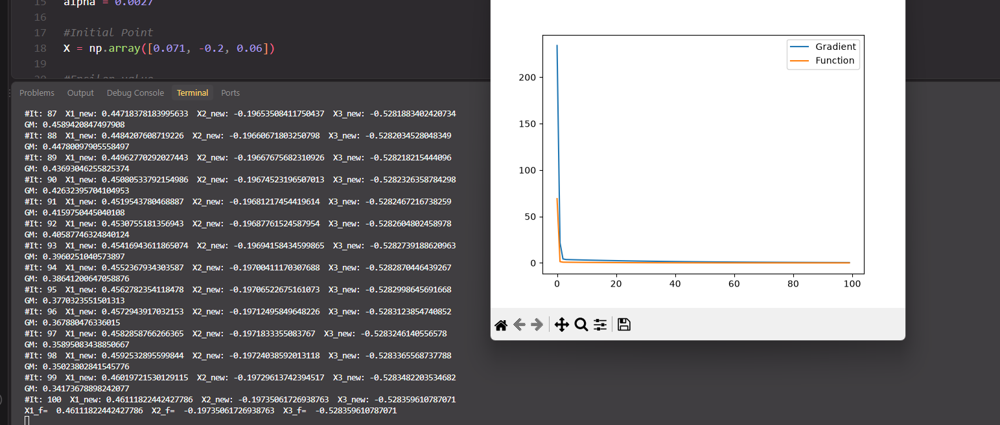
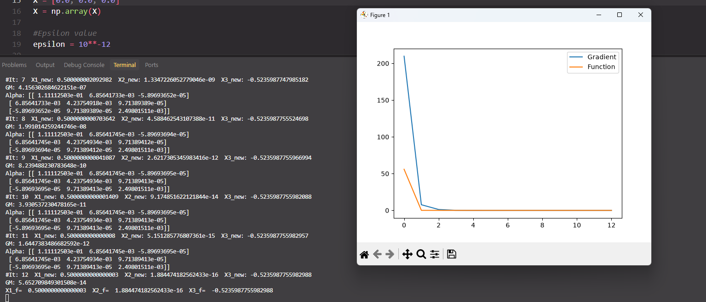
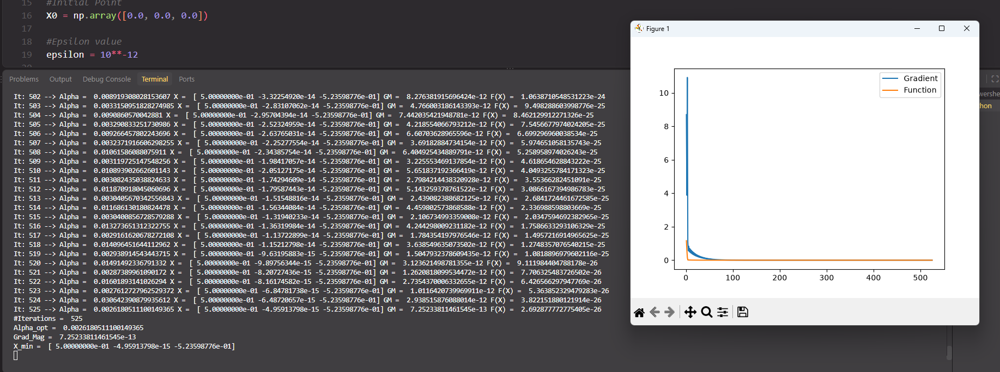

# NLS-Optimizer — Nonlinear System Optimization & CNN Image Classification

This repository contains the two milestones of the Computational Intelligence course project:

- **Milestone 1 — Major Task 1 (this README's main focus):** solving a nonlinear system of three
  equations by reformulating it as an unconstrained least-squares minimization problem, then
  solving that problem with three numerical optimization strategies — **fixed-step Gradient
  Descent**, **Newton-Raphson**, and **Gradient Descent with an optimal line search (Brent's
  method)**.
- **Milestone 2 — Final Part: CIFAR-100 Image Classification with a CNN**, a Convolutional Neural
  Network trained and evaluated with 5-fold cross-validation to classify images into 100 categories
  (see the [Milestone 2](#milestone-2--final-part-cifar-100-image-classification-with-a-cnn)
  section below for full details).

## Contents

- [Milestone 1 — Nonlinear System Optimization](#problem-formulation)
- [Milestone 2 — Final Part: CIFAR-100 Image Classification with a CNN](#milestone-2--final-part-cifar-100-image-classification-with-a-cnn)
- [Authors](#authors)

---

## Milestone 1 — Nonlinear System Optimization

Symbolic differentiation (via SymPy) is used first to derive and verify the closed-form Gradient
vector and Hessian matrix that the numerical methods rely on.

### Problem Formulation

The system consists of three nonlinear equations in `x1, x2, x3`:

```
g1(x1,x2,x3) = 3*x1 - cos(x2*x3) - 0.5
g2(x1,x2,x3) = x1^2 - 81*(x2 + 0.1)^2 + sin(x3) + 1.06
g3(x1,x2,x3) = exp(-x1*x2) + 20*x3 + (10*pi - 3)/3
```

These are combined into a single scalar objective function:

```
F(x1,x2,x3) = 0.5*g1^2 + 0.5*g2^2 + 0.5*g3^2
```

Driving `F` to its minimum (ideally `F ≈ 0`) drives `g1`, `g2`, and `g3` toward zero simultaneously,
which is exactly the solution of the original nonlinear system.

### Files

| File | Purpose |
|---|---|
| `Major_Task1_A&B.py` | **Parts A & B** — Symbolic derivation. Uses SymPy to compute the 3×1 Gradient vector `∇F` and the 3×3 Hessian matrix `H` of `F` analytically, and prints their shapes. |
| `Major_Task1_C.py` | **Part C** — Fixed-step-size **Gradient Descent**. Numerically evaluates the (hand-derived, closed-form) gradient each iteration and updates `X ← X − α·∇F(X)` with a constant learning rate. |
| `Major_Task1_D.py` | **Part D** — **Newton-Raphson Method**. Computes both the gradient and the Hessian at every iteration and updates `X ← X − H⁻¹·∇F(X)`, using the Hessian inverse in place of a fixed learning rate. |
| `Major_Task1_E.py` | **Part E** — Gradient Descent with an **optimal line search**. At each iteration, instead of using a fixed or matrix-based step, the optimal step size `α` along the current gradient direction is found via 1-D minimization (`scipy.optimize.brent`) of `φ(α) = F(X − α·∇F(X))`. |

### Methods

#### Part A & B — Symbolic Gradient & Hessian
Uses `sympy.diff` to differentiate `F` with respect to `x1, x2, x3` to build the gradient, then
differentiates each gradient component again to build the full Hessian matrix. This provides the
exact analytical expressions used (and hard-coded) in Parts C–E, and serves as a correctness check
for those manually derived formulas.

#### Part C — Gradient Descent (fixed step)

```
x_(k+1) = x_k − α · ∇F(x_k)
```

- Learning rate: `α = 0.0027`
- Initial point: `X0 = [0.071, -0.2, 0.06]`
- Convergence tolerance: `ε = 1e-12` on the gradient magnitude `‖∇F‖`
- Max iterations: `100`

#### Part D — Newton-Raphson Method

```
x_(k+1) = x_k − H(x_k)⁻¹ · ∇F(x_k)
```

- Initial point: `X0 = [0, 0, 0]`
- Convergence tolerance: `ε = 1e-12`
- The Hessian is recomputed and re-inverted (`np.linalg.inv`) at every iteration
- Max iterations: `100`

#### Part E — Gradient Descent with Optimal Line Search

```
x_(k+1) = x_k − α*_k · ∇F(x_k),   where α*_k = argmin_α F(x_k − α·∇F(x_k))
```

- Initial point: `X0 = [0, 0, 0]`
- Convergence tolerance: `ε = 1e-12`
- At each step, `α*_k` is found with `scipy.optimize.brent`, avoiding the need to hand-tune a
  learning rate
- Loop runs until `‖∇F‖ < ε` (no fixed iteration cap)

### Gradient Descent vs. Newton-Raphson vs. Line Search

| Method | Step Size | Info Used per Iteration | Cost per Iteration | Notes |
|---|---|---|---|---|
| Gradient Descent (C) | Fixed `α` | Gradient only | Low | Sensitive to the choice of `α`; can be slow or diverge |
| Newton-Raphson (D) | `H⁻¹` | Gradient + Hessian | High (matrix inversion) | Fast local convergence, but costly and sensitive to initial point |
| GD + Line Search (E) | Optimal `α*` per step | Gradient + 1-D search | Medium | No manual tuning of `α`; adapts step size automatically |

### Requirements

```bash
pip install numpy sympy scipy matplotlib
```

### Running the Scripts

```bash
python "Major_Task1_A&B.py"   # Symbolic gradient & Hessian
python "Major_Task1_C.py"     # Gradient Descent (fixed step)
python "Major_Task1_D.py"     # Newton-Raphson
python "Major_Task1_E.py"     # Gradient Descent with line search
```

Each numerical script prints the gradient magnitude and objective value at every iteration, prints
the final solution `[x1, x2, x3]`, and produces a convergence plot (gradient magnitude and
objective function value vs. iteration number) using Matplotlib.

### Screenshots

#### Part C — Gradient Descent (fixed step)



#### Part D — Newton-Raphson Method



#### Part E — Gradient Descent with Optimal Line Search



### Notes

- The Newton-Raphson implementation explicitly computes `H⁻¹` via `np.linalg.inv`. For larger
  systems, solving the linear system `H·Δx = ∇F` directly (e.g. `np.linalg.solve`) is generally
  preferable to explicitly inverting the Hessian.
- Parts C and D use hand-derived closed-form gradient (and, for D, Hessian) expressions rather than
  calling into SymPy at runtime, for numerical performance; Part A & B exist to derive/verify those
  expressions symbolically.
- This project is intended as an educational implementation comparing first-order (gradient-based)
  and second-order (Hessian-based) numerical optimization techniques, along with the effect of a
  fixed vs. adaptively-chosen step size.

---

## Milestone 2 — Final Part: CIFAR-100 Image Classification with a CNN

The final part of the course project moves from numerical optimization of an analytic function to
a real-world machine learning task: building, training, and evaluating a **Convolutional Neural
Network (CNN)** to classify images from the **CIFAR-100** dataset into their correct one of 100
categories, using **TensorFlow / Keras** and **5-fold cross-validation**.

- **File:** `cnn_final_.py` (exported from the original Google Colab notebook `CNN-FINAL.ipynb`)
- **Section:** Section 3, Milestone 2

### Dataset

- **CIFAR-100**, loaded directly via `tensorflow.keras.datasets.cifar100`
- 100 fine-grained classes (e.g. `beaver`, `dolphin`, `bicycle`, `skyscraper`, `mountain`, `worm`,
  `tractor`, …) — the full `class_names` list of all 100 labels is defined in the script
- Images are `32×32×3` RGB
- The built-in train/test split (50,000 / 10,000 images) is **re-merged** into single `inputs` and
  `targets` arrays, since K-Fold cross-validation performs its own splitting

### Preprocessing

1. **Visual sanity check** — a sample image (index `10`) is displayed with `plt.imshow` before and
   after normalization, along with its label, to visually confirm preprocessing is working.
2. **Standardization** — per-channel mean/std normalization:
   `training_images = (training_images - mean) / (std + 1e-7)` (and equivalently for the test set),
   with `mean`/`std` computed over all pixels (`axis=(0,1,2,3)`). This standardization step is
   re-applied at several points in the script (after defining the convolutional layers, after the
   dense layers, etc.), which is functionally redundant but preserved here as it was in the
   original notebook.
3. **Type casting & scaling** — images are cast to `float32` and additionally divided by `255.0`
   to scale pixel values into `[0, 1]`.

### Cross-Validation Setup

- **Method:** `sklearn.model_selection.KFold`
- **Folds:** `num_folds = 5`, `shuffle=True`
- For each of the 5 folds, a **new CNN model is built and trained from scratch**, trained on the
  fold's training split and evaluated on its held-out split.

### Model Architecture

A `keras.models.Sequential` CNN, rebuilt fresh for every fold:

| # | Layer | Config | Name |
|---|---|---|---|
| 1 | `Conv2D` | 64 filters, 3×3, ReLU | `Convolutional_layer_1A` |
| 2 | `Conv2D` | 64 filters, 3×3, ReLU | `Convolutional_layer_1B` |
| 3 | `MaxPooling2D` | 2×2 | `Maxpooling_2D_Layer_1` |
| 4 | `Conv2D` | 128 filters, 3×3, ReLU | `Convolutional_layer_2A` |
| 5 | `Conv2D` | 128 filters, 3×3, ReLU | `Convolutional_layer_2B` |
| 6 | `MaxPooling2D` | 2×2 | `Maxpooling_2D_Layer_2` |
| 7 | `Conv2D` | 256 filters, 3×3, ReLU | `Convolutional_layer_3A` |
| 8 | `MaxPooling2D` | 2×2 | `Maxpooling_2D_Layer_3` |
| 9 | `Dropout` | rate `0.2` (regularization between conv and dense stages) | — |
| 10 | `Flatten` | — | `Flatten` |
| 11 | `Dense` | 1024 units, ReLU | `Hidden_layer_1` |
| 12 | `Dropout` | rate `0.2` | — |
| 13 | `Dense` | 512 units, ReLU | `Hidden_layer_2` |
| 14 | `Dropout` | rate `0.2` | — |
| 15 | `Dense` | 256 units, ReLU | `Hidden_layer_3` |
| 16 | `Dense` | 100 units, ReLU | `Hidden_layer_4` |
| 17 | `Dense` | 100 units, Softmax (final classification output over 100 classes) | `Output_layer` |

**Compilation:**
- Optimizer: `adam`
- Loss: `sparse_categorical_crossentropy`
- Metric: `accuracy`

### Training Configuration

| Hyperparameter | Value |
|---|---|
| Batch size | 64 |
| Epochs per fold | 300 |
| Cross-validation folds | 5 |
| Optimizer | Adam |
| Loss function | Sparse Categorical Crossentropy |

### Evaluation & Reporting

- After each fold, the model is evaluated on its held-out split with `cnn_model.evaluate(...)`,
  producing a fold-specific **loss** and **accuracy**.
- Per-fold accuracy and loss are appended to `acc_per_fold` and `loss_per_fold`.
- After all 5 folds complete, the script prints:
  - Loss and accuracy for **each individual fold**
  - The **average accuracy** across folds (with standard deviation) and the **average loss**
- **Training curves:** accuracy vs. epoch (`history.history['accuracy']`) and loss vs. epoch
  (`history.history['loss']`) are plotted with Matplotlib from the last-trained fold's history.
- **Confusion matrix:** predictions are generated on the training set
  (`cnn_model.predict(training_images).argmax(axis=1)`) and compared against the true labels using
  `sklearn.metrics.confusion_matrix`, then visualized with a custom `plot_confusion_matrix` helper
  (color-mapped heatmap with per-cell counts, optional row-normalization). Note the confusion
  matrix in this script is rendered for classes `range(10)` (the first 10 of the 100 classes) as a
  readable subset rather than the full 100×100 matrix.

### Requirements

```bash
pip install tensorflow numpy matplotlib scikit-learn
```

### Running

```bash
python cnn_final_.py
```

> The script was originally developed and run in Google Colab (GPU runtime strongly recommended —
> 5 folds × 300 epochs on CIFAR-100 is computationally intensive) and later exported as a standalone
> `.py` file.

### Implementation Notes

- Because a **new model is trained per fold** for 300 epochs each, total training time is
  substantial; using Colab's/GPU acceleration is recommended, and epoch count can be reduced for
  quicker experimentation.
- The dataset is merged (`train` + `test`) before K-Fold splitting, so the reported cross-validated
  accuracy reflects performance across the entire CIFAR-100 dataset rather than a single fixed
  test split.
- The normalization step is repeated multiple times in the code (an artifact of the original
  notebook's structure); this does not change correctness but is redundant and could be
  simplified to a single normalization pass.

## Authors

**Nonlinear System Optimization - CNN Image Classification (Section 3)**
- Youssef Malak
- Bavly Ehab
- Bassam Sobhy
